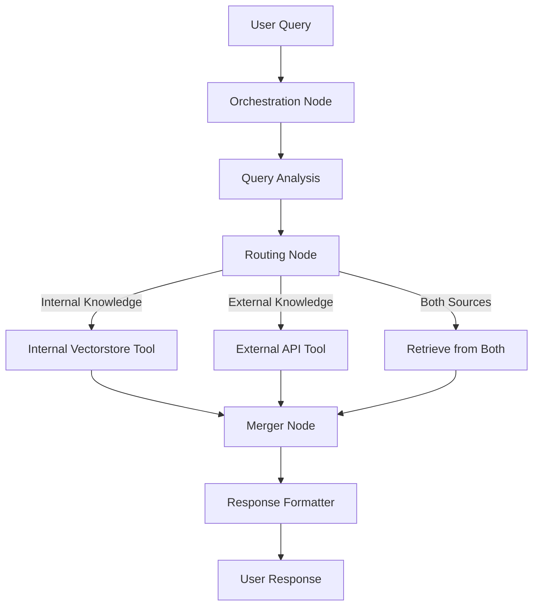

# LangGraph Orchestration for Multi-Source RAG

This document outlines how to implement LangGraph to orchestrate calls to multiple knowledge sources in our agentic RAG system.

## Graph-Based Orchestration Architecture

LangGraph provides an elegant solution for orchestrating complex flows between multiple knowledge sources through a graph-based architecture. This approach allows us to:

1. Route queries intelligently based on their content
2. Execute parallel retrievals from multiple sources
3. Merge information contextually
4. Maintain conversation history and context



## LangGraph Implementation with Tool Calling

### 1. Define Knowledge Source Tools

First, we define tools for each knowledge source:

```python
from langchain_core.tools import tool
from typing import List, Dict, Any, Optional

@tool(response_format="content_and_artifact")
def retrieve_from_internal(query: str):
    """Retrieve information from internal vectorstore."""
    # Retrieve from Qdrant or other primary vector store
    retrieved_docs = vector_store.similarity_search(query, k=3)
    serialized = "\n\n".join(
        (f"Source: {doc.metadata}\\n" f"Content: {doc.page_content}")
        for doc in retrieved_docs
    )
    return serialized, retrieved_docs

@tool(response_format="content_and_artifact")
def retrieve_from_external(query: str):
    """Retrieve information from external API like Perplexity."""
    # Call Perplexity API
    perplexity_client = PerplexityClient(api_key=PERPLEXITY_API_KEY)
    response = perplexity_client.query(query)
    
    # Convert to document format
    external_docs = []
    for result in response.get("results", []):
        doc = Document(
            page_content=result.get("text", ""),
            metadata={
                "source": result.get("url", "perplexity"),
                "title": result.get("title", "External Source"),
                "external": True
            }
        )
        external_docs.append(doc)
    
    serialized = "\n\n".join(
        (f"Source: {doc.metadata}\\n" f"Content: {doc.page_content}")
        for doc in external_docs
    )
    return serialized, external_docs
```

### 2. Create the LangGraph State Flow

Next, we set up the graph structure to orchestrate the tools:

```python
from langgraph.graph import StateGraph, MessagesState
from langgraph.prebuilt import ToolNode, tools_condition
from langgraph.checkpoint.memory import MemorySaver
from langchain_core.messages import SystemMessage

# Set up the graph state
graph_builder = StateGraph(MessagesState)

# Define the nodes
def query_analyzer(state: MessagesState):
    """Analyze the query to determine which knowledge sources to use."""
    system_prompt = """
    You are an expert query router. Analyze the user query to determine the most appropriate knowledge source:
    - For personal or internal knowledge, use the 'retrieve_from_internal' tool.
    - For recent events or external knowledge, use the 'retrieve_from_external' tool.
    - If both are needed, call both tools in sequence.
    
    Always explain your routing decision.
    """
    llm_with_system = llm.bind(system_message=system_prompt)
    llm_with_tools = llm_with_system.bind_tools([
        retrieve_from_internal, 
        retrieve_from_external
    ])
    response = llm_with_tools.invoke(state["messages"])
    return {"messages": [response]}

# Define tool execution node
tools = ToolNode([retrieve_from_internal, retrieve_from_external])

# Response generator using merged context
def generate_response(state: MessagesState):
    """Generate a response using all the retrieved information."""
    # Get tool messages
    tool_messages = [msg for msg in state["messages"] if msg.type == "tool"]
    
    # Format documents into context
    docs_content = "\n\n".join(msg.content for msg in tool_messages)
    
    system_message_content = """
    You are an assistant that combines information from multiple sources.
    Use the following context to provide a comprehensive answer.
    Clearly distinguish between internal knowledge and external sources in your answer.
    If there are conflicts between sources, explain them.
    
    CONTEXT:
    
    {}
    """.format(docs_content)
    
    # Keep only human and non-tool AI messages for the conversation history
    conversation_messages = [
        msg for msg in state["messages"]
        if msg.type in ("human", "system") or
           (msg.type == "ai" and not msg.tool_calls)
    ]
    
    prompt = [SystemMessage(content=system_message_content)] + conversation_messages
    response = llm.invoke(prompt)
    
    # Add citation formatting
    citations = format_citations([msg for msg in state["messages"] if msg.type == "tool"])
    if citations:
        response.content += "\n\n" + citations
    
    return {"messages": [response]}

# Citation formatter
def format_citations(tool_messages):
    """Format citations from tool messages."""
    citations = []
    for i, msg in enumerate(tool_messages):
        # Extract document metadata from artifacts
        if hasattr(msg, "artifacts") and msg.artifacts:
            docs = msg.artifacts[0]
            for j, doc in enumerate(docs):
                if isinstance(doc, Document):
                    source = doc.metadata.get("source", "Unknown")
                    is_external = doc.metadata.get("external", False)
                    
                    if is_external:
                        title = doc.metadata.get("title", "External Source")
                        url = source if "http" in source else "#"
                        citations.append(f"[{i+1}.{j+1}] {title}: {url}")
                    else:
                        # Format as Obsidian URI
                        vault_name = "MyVault"  # Get from config
                        encoded_file = urllib.parse.quote(source)
                        obsidian_uri = f"obsidian://open?vault={vault_name}&file={encoded_file}"
                        citations.append(f"[{i+1}.{j+1}] {source}: {obsidian_uri}")
    
    return "Citations:\n" + "\n".join(citations) if citations else ""

# Build the graph
graph_builder.add_node("query_analyzer", query_analyzer)
graph_builder.add_node("tools", tools)
graph_builder.add_node("generate", generate_response)

# Set entry point
graph_builder.set_entry_point("query_analyzer")

# Add edges
graph_builder.add_conditional_edges(
    "query_analyzer",
    tools_condition,
    {END: END, "tools": "tools"}
)
graph_builder.add_edge("tools", "generate")
graph_builder.add_edge("generate", END)

# Compile the graph with memory
memory = MemorySaver()
graph = graph_builder.compile(checkpointer=memory)
```

### 3. Alternative: ReAct Agent for Simpler Implementation

For a simpler implementation, we can use LangGraph's prebuilt ReAct agent:

```python
from langgraph.prebuilt import create_react_agent

# Define all tools
tools = [
    retrieve_from_internal,
    retrieve_from_external
]

# Create a ReAct agent
agent_executor = create_react_agent(
    llm,
    tools,
    system_message="""
    You are an assistant that can access multiple knowledge sources.
    For questions about personal knowledge or historical information, use the internal knowledge source.
    For questions about recent events or external information, use the external knowledge source.
    Always provide citations for your information sources.
    """,
    checkpointer=memory
)
```

## Usage Example

Here's how to use the LangGraph-based multi-source RAG system:

```python
# Initialize a conversation thread
config = {"configurable": {"thread_id": "user_123"}}

# Process a user query
user_query = "What are the key components of living knowledge management and how do they relate to recent developments in AI?"

# Stream the response (shows intermediate steps)
for step in graph.stream(
    {"messages": [{"role": "user", "content": user_query}]},
    stream_mode="values",
    config=config,
):
    # Display the latest message
    step["messages"][-1].pretty_print()
```

## Benefits of LangGraph for Multi-Source RAG

1. **Transparent Decision Making**: The graph structure makes the query routing logic visible and adjustable.

2. **Stateful Conversations**: Maintains conversation history for contextual follow-up questions.

3. **Parallel Processing**: Can retrieve from multiple sources simultaneously when needed.

4. **Conditional Logic**: Routes queries to appropriate knowledge sources based on content.

5. **Extensibility**: Easy to add new knowledge sources as additional tools.

6. **Visualization**: Graph structure can be visualized for debugging and explanation.

## Implementation Plan

1. Implement the basic LangGraph structure with internal and external knowledge tools
2. Add routing logic based on query analysis
3. Develop the context merger with source attribution
4. Implement citation formatting for different knowledge sources
5. Add history awareness for follow-up queries
6. Test with various query types to ensure proper routing and response generation 