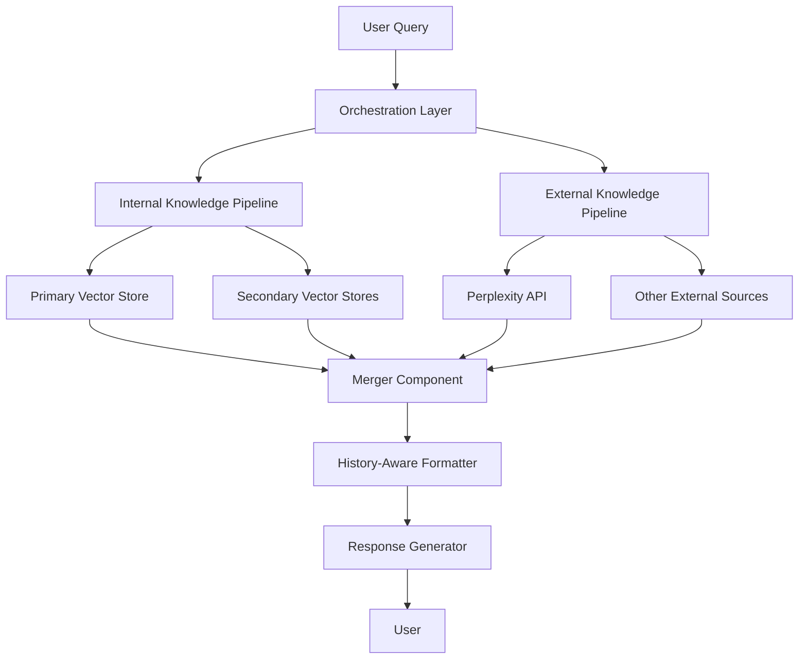

# Agentic RAG System: Multi-Source Knowledge Integration

## System Architecture



## Core Components

### 1. Orchestration Layer
- **Purpose**: Route queries to appropriate knowledge sources
- **Implementation**: 
  - Creates a unified interface for handling queries
  - Determines which knowledge source(s) to query based on content analysis
  - Manages parallel retrieval when needed

### 2. Internal Knowledge Pipeline
- **Purpose**: Access information from Vector Stores
- **Implementation**:
  - Primary Vector Store: Main repository for frequently accessed information
  - Secondary Vector Stores: Specialized knowledge bases for specific domains
  - Retrieval mechanism based on semantic similarity

### 3. External Knowledge Pipeline
- **Purpose**: Access information from external APIs/web
- **Implementation**:
  - Perplexity API Integration: Access real-time web information
  - Web Content Extraction: Retrieve and process information from websites
  - API Standardization: Normalize outputs from different external sources

### 4. Merger Component
- **Purpose**: Combine and prioritize information from multiple sources
- **Implementation**:
  - Source Deduplication: Remove redundant information
  - Relevance Ranking: Prioritize most relevant information
  - Source Attribution: Track source of each piece of information

### 5. History-Aware Formatter
- **Purpose**: Context-aware response generation
- **Implementation**:
  - Conversation History Integration: Consider previous exchanges
  - Format standardization: Ensure consistent output structure
  - Citation Management: Track and format citations appropriately

## Technical Implementation Plan

### Phase 1: Multi-Source RAG Implementation

1. Create a new implementation in `multi_source_rag.py` file that follows the structure of the existing `obsidian_rag.py` but enhances it with multiple knowledge sources.

2. Implementation Details:
   ```python
   # Pipeline class structure - Following the same pattern as obsidian_rag.py
   class Pipeline:
       class Valves(BaseModel):
           # Configuration parameters
           OPENAI_API_KEY: str
           OPENAI_MODEL: str
           PRIMARY_VECTOR_STORE_URL: str
           SECONDARY_VECTOR_STORE_URL: str = None
           PERPLEXITY_API_KEY: str = None
           SYSTEM_PROMPT: str
           
       def __init__(self):
           # Initialize with default values
           
       async def on_startup(self):
           # Initialize connections to vector stores and APIs
           
       async def on_shutdown(self):
           # Clean up resources
           
       def pipe(self, user_message, model_id, messages, body):
           # Process the user query and generate response
   ```

3. Core Functions:
   - `query_router()`: Determine which knowledge sources to use
   - `retrieve_from_vector_store()`: Get information from internal stores
   - `retrieve_from_external_api()`: Get information from external sources
   - `merge_retrieved_documents()`: Combine information from multiple sources
   - `format_response_with_citations()`: Generate final response with proper citations

4. Integration Points:
   - Connection to Qdrant or other vector databases for internal knowledge
   - Integration with Perplexity API for external knowledge
   - OpenAI API for embedding generation and response formatting

### Key Components to Implement

#### Query Router
```python
def query_router(self, query: str) -> List[str]:
    """
    Analyze the query to determine which knowledge sources to use.
    
    Args:
        query: The user's question
        
    Returns:
        List of source identifiers to query
    """
    sources_to_query = []
    
    # Check if query requires recent information
    if self._requires_recent_info(query):
        sources_to_query.append("external_api")
    
    # Check if query is about internal knowledge
    if self._is_about_internal_knowledge(query):
        sources_to_query.append("primary_vector_store")
        
        # Check if query requires specialized knowledge
        if self._requires_specialized_knowledge(query):
            sources_to_query.append("secondary_vector_store")
    
    # If no specific source is identified, use all available
    if not sources_to_query:
        sources_to_query = ["primary_vector_store", "external_api"]
    
    return sources_to_query
```

#### Multiple Source Retrieval
```python
async def retrieve_from_all_sources(self, query: str, sources: List[str]) -> Dict[str, List[Document]]:
    """
    Retrieve documents from multiple sources in parallel.
    
    Args:
        query: The user's question
        sources: List of sources to query
        
    Returns:
        Dictionary mapping source names to retrieved documents
    """
    results = {}
    
    # Create tasks for each source
    retrieval_tasks = []
    for source in sources:
        if source == "primary_vector_store":
            task = self.retrieve_from_vector_store(query, self.primary_vector_store)
            retrieval_tasks.append(("primary_vector_store", task))
        elif source == "secondary_vector_store" and self.secondary_vector_store:
            task = self.retrieve_from_vector_store(query, self.secondary_vector_store)
            retrieval_tasks.append(("secondary_vector_store", task))
        elif source == "external_api" and self.perplexity_client:
            task = self.retrieve_from_perplexity(query)
            retrieval_tasks.append(("external_api", task))
    
    # Execute all retrieval tasks in parallel
    for source_name, task in retrieval_tasks:
        try:
            results[source_name] = await task
        except Exception as e:
            print(f"Error retrieving from {source_name}: {str(e)}")
            results[source_name] = []
    
    return results
```

#### Response Formatting with Multiple Sources
```python
def format_response_with_citations(self, query: str, source_documents: Dict[str, List[Document]]) -> str:
    """
    Format retrieved documents into a prompt with proper citations.
    
    Args:
        query: The user's question
        source_documents: Dictionary of documents from different sources
        
    Returns:
        Formatted prompt with context and citations
    """
    all_documents = []
    citations = []
    
    # Process internal knowledge sources
    if "primary_vector_store" in source_documents:
        for i, doc in enumerate(source_documents["primary_vector_store"]):
            all_documents.append(f"[Internal {i+1}] {doc.page_content}")
            citations.append(f"[Internal {i+1}] {doc.metadata.get('source', 'Unknown Internal Source')}")
    
    if "secondary_vector_store" in source_documents:
        for i, doc in enumerate(source_documents["secondary_vector_store"]):
            all_documents.append(f"[Specialized {i+1}] {doc.page_content}")
            citations.append(f"[Specialized {i+1}] {doc.metadata.get('source', 'Unknown Specialized Source')}")
    
    # Process external API results
    if "external_api" in source_documents:
        for i, doc in enumerate(source_documents["external_api"]):
            all_documents.append(f"[External {i+1}] {doc.page_content}")
            citations.append(f"[External {i+1}] {doc.metadata.get('source', 'Unknown External Source')}")
    
    # Format the context
    context = "\n\n".join(all_documents)
    formatted_citations = "\n".join(citations)
    
    return f"Context:\n{context}\n\nCitations:\n{formatted_citations}\n\nQuestion: {query}"
```

### Phase 2: LangGraph Implementation (Future Enhancement)

As outlined in the separate langgraph_implementation.md document, we'll implement a more sophisticated orchestration system using LangGraph in Phase 2. This will enhance the flexibility and robustness of our multi-source RAG system.

## Integration with Open-WebUI Pipelines

The implementation will follow Open-WebUI's pipeline structure with these key components:

1. Begin with creating the `multi_source_rag.py` file as the main entry point
2. Ensure the Pipeline class structure matches the expected format:
   - Valves for configuration
   - on_startup, on_shutdown, and pipe methods
3. Implement the core functionality within this structure

### Pipeline Implementation Structure

```python
# Pipeline class implementation
class Pipeline:
    class Valves(BaseModel):
        # Configuration options
        
    def __init__(self):
        # Initialize state
        
    async def on_startup(self):
        # Initialize connections and resources
        
    async def on_shutdown(self):
        # Clean up resources
        
    def pipe(self, user_message, model_id, messages, body):
        # Core RAG pipeline logic:
        # 1. Analyze query and route to appropriate sources
        # 2. Retrieve information from internal and external sources
        # 3. Merge and rank retrieved information
        # 4. Generate response with citations
        # 5. Stream response back to user
```

## Deployment and Testing

1. Development:
   - Create the multi_source_rag.py file following the structure above
   - Implement core functions incrementally
   - Test with sample queries against known data sources

2. Integration Testing:
   - Test integration with Open-WebUI
   - Verify correct behavior with multiple knowledge sources
   - Ensure proper citation and source attribution

3. Deployment:
   - Deploy the pipeline to a test environment
   - Monitor performance and refine as needed
   - Document API and usage patterns 